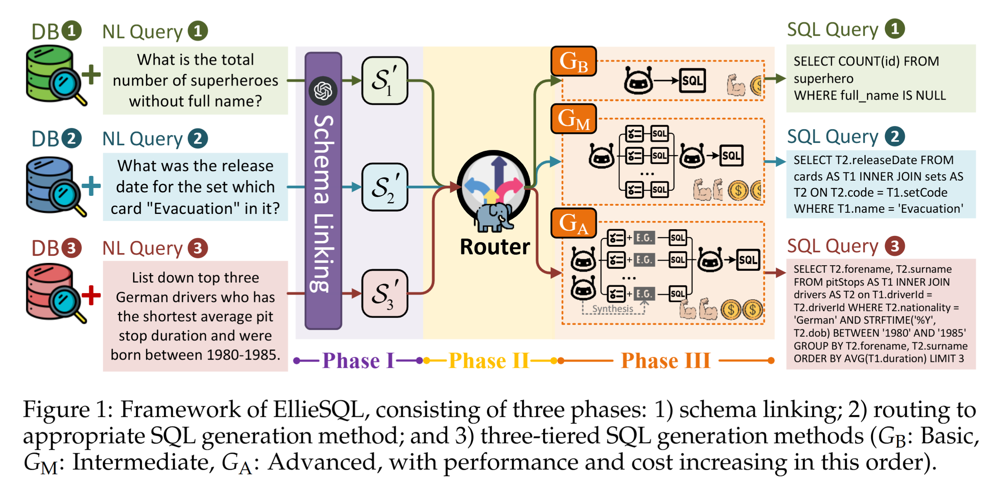

<h1 align="center">🐘EllieSQL: Cost-Efficient Text-to-SQL <br> with Complexity-Aware Routing</h1>

Official repository for the paper *"EllieSQL: Task-Aware Routing towards Cost-Efficient Natural Language to SQL Generation"*.



## 🎉News

[March 25, 2025] 🐘EllieSQL is publicly released!

## 📖Overview

Text-to-SQL automatically translates natural language queries to SQL, allowing non-technical users to retrieve data from databases without specialized SQL knowledge. Despite the success of advanced LLM-based Text-to-SQL approaches on leaderboards, their unsustainable computational costs—often overlooked—stand as the "elephant in the room" in current leaderboard-driven research, limiting their economic practicability for real-world deployment and widespread adoption. 

To tackle this, we exploratively propose EllieSQL, a complexity-aware routing framework that assigns queries to suitable SQL generation methods based on estimated complexity. We design and investigate multiple routers to direct simple queries to efficient approaches while reserving computationally intensive methods for complex cases. Drawing from economics, we introduce the Token Elasticity of Performance (TEP) metric, capturing cost-efficiency by quantifying how responsive the performance gains relative to token investment in SQL generation. Our experiments on the Bird dataset show that compared to always using the most advanced methods in our study, EllieSQL with the Qwen2.5-0.5B-DPO router reduces token use by over 40% without compromising performance, achieving more than a 2× boost in TEP over non-routing approaches. This not only advances the pursuit of cost-efficient Text-to-SQL but also invites the community to weigh resource efficiency alongside performance, contributing to progress in sustainable Text-to-SQL.


## 📂Project Structure

```
🐘EllieSQL/
├── config/                     # Configuration files
│   ├── config_example.yaml     # A provided config example
│   ├── config.yaml             # Config file for LLM API keys and needed paths
│   └── xxx_config.yaml         # Config for SFT
├── data/                       # Data files and databases
├── examples/                   # Examples for usage
├── scripts/                    # Bash scripts
├── src/                        # Source code for the project
│   ├── core/                   # Core functionalities and utilities
│   ├── evaluation/             # Evaluation scripts
│   ├── modules/                # Modular components for Text-to-SQL
│   │   ├── schema_linking/     # Schema linking modules
│   │   ├── sql_generation/     # SQL generation modules
│   │   ├── post_processing/    # Post-processing modules
│   │   └── base.py             # Base classes for modules
│   ├── router/                 # Implemnetation of Routers
│   ├── sft/                    # Data preparation for SFT and implementation of SFT
│   ├── dpo/                    # Data preparation for DPO and implementation of DPO
│   ├── pipeline.py             # Pipeline management for processing queries
│   ├── pipeline_factory.py     # Factory for creating different pipeline of levels
│   ├── run_base.py             # Runner for the base methods: G_B, G_M, G_A
│   └── run_routing.py          # Runner for the 🐘EllieSQL with routers
└── README.md                   # This Readme
```

## ⚙Environment Setup

1. Create and activate a conda environment:

   ```bash
   conda create --name elliesql python=3.12
   conda activate elliesql
   cd EllieSQL
   pip install -r requirements.txt
   ```

2. Configure your settings:

   ```bash
   cp config/config_example.yaml config/config.yaml
   ```

   Edit `config/config.yaml` to set up your:

   - API Base Url
   - API keys
   - Dataset paths
   - Model paths
   - Other configurations

3. Download required resources:

   - Bird dataset: [Bird Official Website](https://bird-bench.github.io/)
   - Router checkpoints: Available on [Hugging Face](https://huggingface.co/derrickzhu/EllieSQL_Router_Checkpoints)

## 💻Hardware Requirements

- Training: 4 × NVIDIA RTX 4090
- Inference: 1 × NVIDIA RTX 4090

## 🧪Running Experiments

### Base Methods

1. Ensure your configuration in `config/config.yaml` is correct
2. Run base experiments:

```bash
bash scripts/exp/run_base.sh
```

### Routing Methods

1. Download router checkpoints
2. Update checkpoint paths in `scripts/exp/run_routing.sh`
3. Run routing experiments:

```bash
bash scripts/exp/run_routing.sh
```

Note: Remember to specify the correct GPU device in the scripts according to your setup.

## 🔥Training Routers

We provide scripts for training different types of routers:

- Classification-based routers
- Cascading routers
- Preference learning-based routers

Example: Training a RoBERTa-based classifier router:

```bash
bash scripts/sft/roberta_classifier_sft.sh
```

You can also change hyperparameters in fine-tuning by editing SFT configs in  `config/`.

## ✏️Citation

If you find our work useful or inspiring, please kindly cite:

```

```